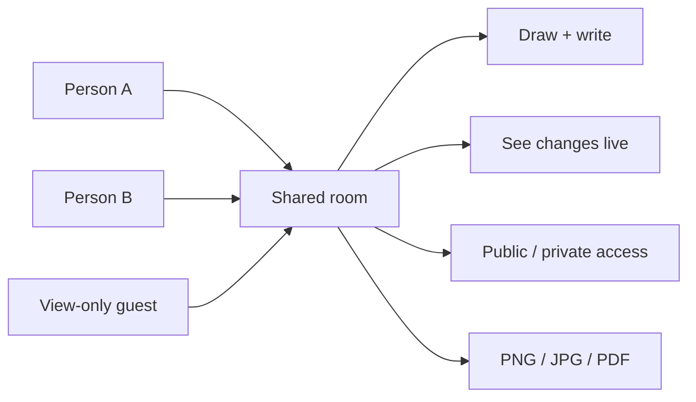
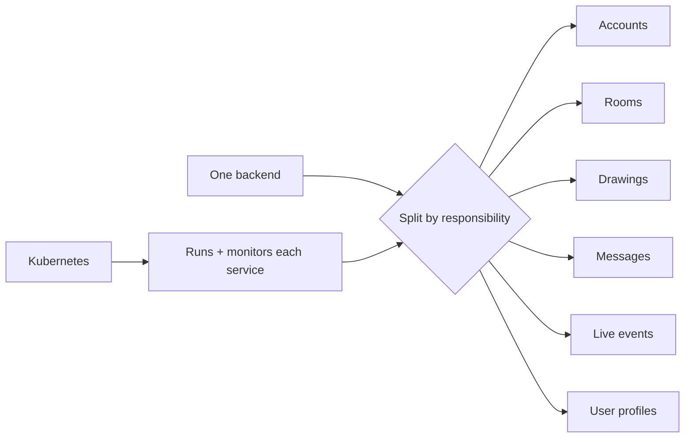
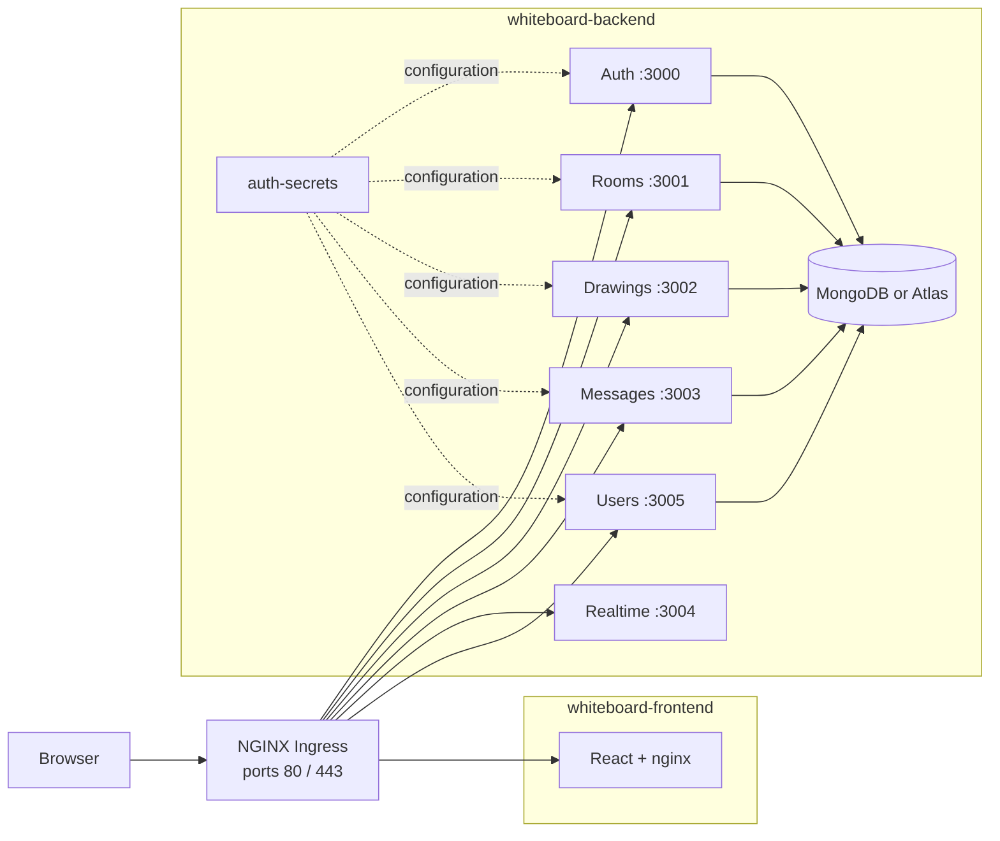
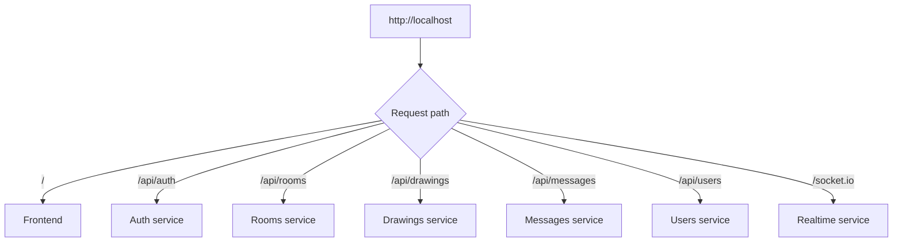
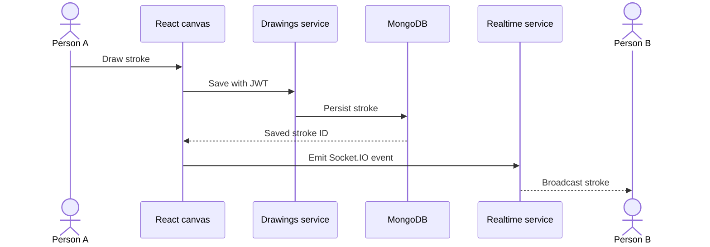
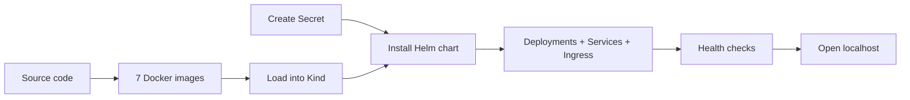

# Whiteboard on Kubernetes

**A real-time collaborative whiteboard rebuilt as independently managed microservices inside Kubernetes.**

Users still create rooms, draw together, control access, and export boards. Kubernetes changes how those capabilities are packaged, routed, monitored, and operated.

## Product experience



## Why Kubernetes?

The original application uses one backend. This version gives each responsibility its own service.



This makes service boundaries visible and allows each part to be deployed or scaled independently.

## Complete system



Two namespace-scoped Ingress resources define the routes, while the NGINX Ingress Controller exposes them through the same cluster entry address.

## One address, seven destinations



The browser does not need to know individual service ports. Ingress reads the path and chooses the destination.

## Real-time drawing path



MongoDB keeps the drawing for later; Socket.IO makes it appear immediately for connected users.

## Kubernetes in plain language

| Kubernetes object | Role in this project |
|---|---|
| Container | Packaged frontend or microservice |
| Pod | One running copy of a container |
| Deployment | Keeps the requested pod count healthy |
| Service | Stable internal address for a pod |
| Ingress | Routes browser paths to Services |
| Namespace | Separates frontend and backend resources |
| Secret | Supplies MongoDB and JWT configuration |
| Helm | Primary installation and upgrade blueprint |
| Kustomize | Smaller alternative/reference deployment |
| Kind | Runs the Kubernetes cluster locally in Docker |

## Deployment journey



Helm is the complete route. Kustomize is retained as an alternative backend reference and does not include the users service or frontend.

## Documentation map

| Guide | Covers |
|---|---|
| [Architecture](docs/architecture.md) | Namespaces, workloads, networking and dependencies |
| [Service catalog](docs/services.md) | Every microservice, route, port and data owner |
| [Request flows](docs/request-flows.md) | Login, rooms, drawing, realtime and view-only paths |
| [Kubernetes concepts](docs/kubernetes-concepts.md) | Kubernetes objects explained through this project |
| [Helm deployment](docs/helm-deployment.md) | Complete build, install, verify, upgrade and teardown |
| [Kustomize deployment](docs/kustomize-deployment.md) | Alternative path and its exact scope |
| [Data and security](docs/data-and-security.md) | MongoDB, JWT, Secrets and access boundaries |
| [Operations](docs/operations.md) | Probes, scaling, Redis, resources and troubleshooting |
| [Local development](docs/local-development.md) | Run services without Kubernetes |
| [Current implementation](docs/current-implementation.md) | Verified gaps and production next steps |

## Quick deployment outline

```bash
kind create cluster --name whiteboard --config kind-config.yaml
```

```bash
# Build the seven images, load them into Kind, create auth-secrets,
# then install the complete chart:
cd backend
helm install whiteboard ./chart -n whiteboard-backend
```

Follow the ordered [Helm deployment guide](docs/helm-deployment.md); the Secret and image-loading steps are required.

## Related study

- [Original whiteboard application](https://github.com/SidheshwarSarangal/whiteBoard)
- [Step-by-step Kubernetes study](https://github.com/SidheshwarSarangal/study-of-k8s-method-project-of-white-board)
