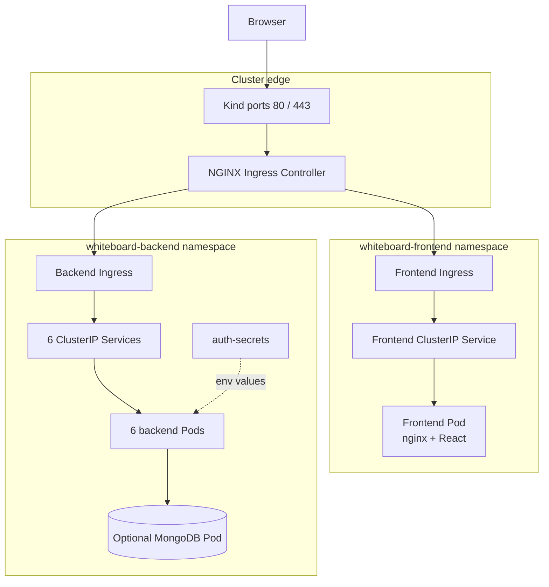
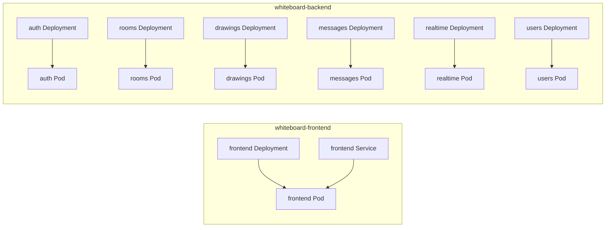
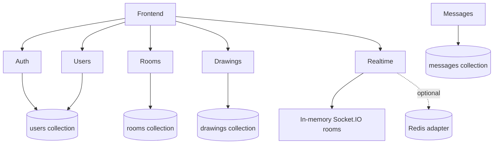

# Architecture

[← Documentation home](../README.md)

## Layered view



Ingress resources can only reference Services in their own namespace, so the chart creates one frontend Ingress and one backend Ingress.

## Workload inventory



Every Deployment currently requests one replica. Every workload has a matching ClusterIP Service.

## Dependency map



Auth and users intentionally share the same MongoDB user collection through compatible schemas.

## Repository structure

```text
k8sWhiteBoard/
├── frontend/                 # React app, nginx image, optional raw manifests
├── backend/
│   ├── *-service/            # Six Node.js microservices
│   ├── chart/                # Complete Helm deployment
│   └── k8s/                  # Kustomize reference + MongoDB manifest
└── kind-config.yaml          # Local cluster and host port mapping
```
