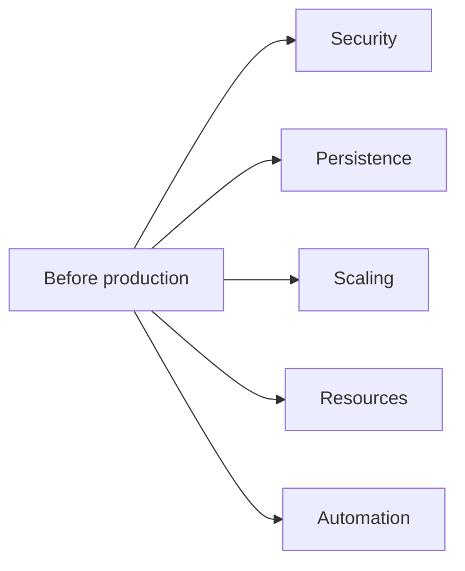

# Current implementation

[← Documentation home](../README.md)

These are verified repository observations, not completed fixes.

| Area | Current state |
|---|---|
| Replicas | Every workload defaults to one replica. |
| Realtime scaling | Redis adapter exists in code; chart has no Redis or `REDIS_URL`. |
| Database | Local MongoDB has no PVC, credentials or resource limits. |
| Authorization | Drawings/messages use JWT; most rooms/users routes and sockets do not. |
| Room password | Stored and returned as plain text. |
| Join order | Collaboration ID is saved before room edit permission succeeds. |
| Drawing ownership | Drawings service stores JWT user ID; frontend reload filtering compares against username, affecting per-user undo history. |
| Chat | Messages and live chat backend exist; current frontend has no chat interface. |
| Resources | Only frontend declares CPU/memory requests and limits. |
| Probes | Backend has probes; frontend and MongoDB do not. |
| TLS | Kind maps 443, but chart defines no TLS section/certificate. |
| Network security | No NetworkPolicies or restricted CORS rules are defined. |
| Deployment paths | Helm is complete; Kustomize omits users and frontend. |
| Automation | No CI workflow is present for image build, test, scan or deployment. |
