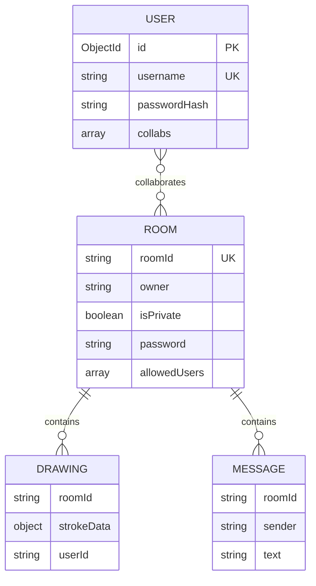
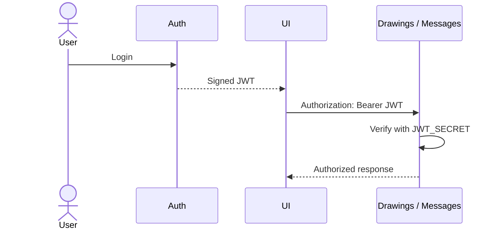
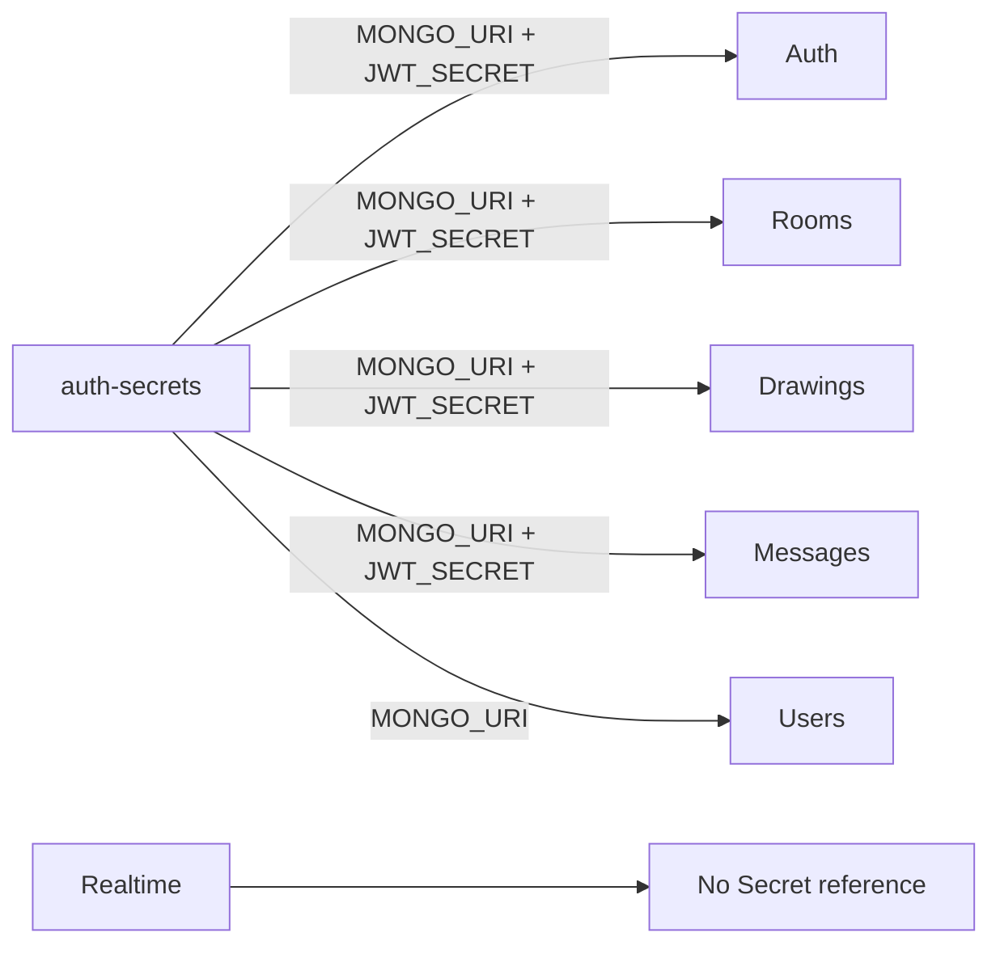

# Data and security

[← Documentation home](../README.md)

## Data ownership

## JWT path

## Secret distribution

The Secret removes credentials from workload YAML, but Kubernetes Secrets are encoded rather than automatically encrypted at rest.

## Current trust boundaries

| Boundary | Current state |
|---|---|
| User passwords | Hashed with bcrypt in auth service |
| Room passwords | Stored as plain strings |
| Drawing/message REST | JWT required |
| Room/user REST | Mostly public |
| Socket.IO connection | No JWT authentication |
| NetworkPolicy | Not defined |
| TLS | Port 443 is mapped, but no TLS certificate/configuration is defined |
