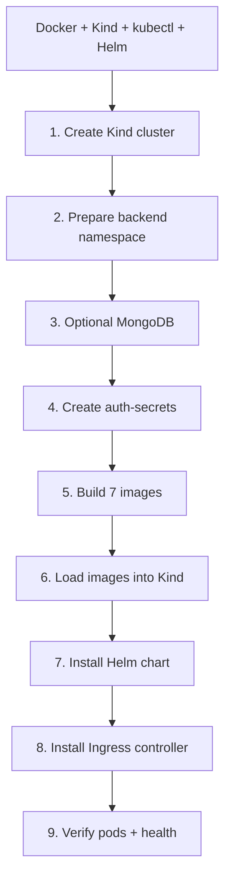
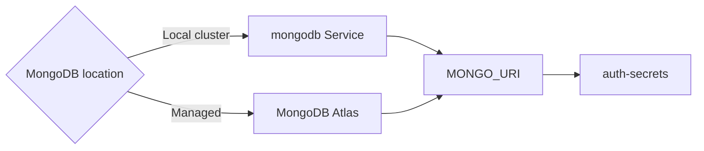

# Helm deployment

[← Documentation home](../README.md)

Helm is the complete deployment path: frontend, six backend services, Services, namespaces and Ingress resources.

## Ordered deployment



## 1. Cluster

```bash
kind create cluster --name whiteboard --config kind-config.yaml
```

`kind-config.yaml` maps host ports 80 and 443 to the control-plane container.

## 2. Namespace ownership

Create the backend namespace before its Secret and label it for Helm adoption:

```bash
kubectl create namespace whiteboard-backend
kubectl label namespace whiteboard-backend app.kubernetes.io/managed-by=Helm
kubectl annotate namespace whiteboard-backend meta.helm.sh/release-name=whiteboard meta.helm.sh/release-namespace=whiteboard-backend
```

## 3. Database and Secret



Optional local database:

```bash
kubectl apply -f backend/k8s/mongodb.yaml
kubectl wait -n whiteboard-backend --for=condition=ready pod -l app=mongodb --timeout=120s
```

```bash
kubectl create secret generic auth-secrets -n whiteboard-backend \
  --from-literal=MONGO_URI='mongodb://mongodb:27017/whiteboard' \
  --from-literal=JWT_SECRET='YOUR_JWT_SECRET_MIN_32_CHARS'
```

## 4. Images

```bash
docker build -t auth-service:latest backend/auth-service
docker build -t rooms-service:latest backend/rooms-service
docker build -t drawings-service:latest backend/drawings-service
docker build -t messages-service:latest backend/messages-service
docker build -t realtime-service:latest backend/realtime-service
docker build -t users-service:latest backend/users-service
docker build -t frontend:latest frontend
```

```bash
kind load docker-image auth-service:latest rooms-service:latest drawings-service:latest messages-service:latest realtime-service:latest users-service:latest frontend:latest --name whiteboard
```

## 5. Chart and Ingress

```bash
helm install whiteboard ./backend/chart -n whiteboard-backend
```

```bash
kubectl apply -f https://raw.githubusercontent.com/kubernetes/ingress-nginx/main/deploy/static/provider/kind/deploy.yaml
kubectl wait --namespace ingress-nginx --for=condition=ready pod --selector=app.kubernetes.io/component=controller --timeout=120s
```

## 6. Verify

```bash
kubectl get pods -n whiteboard-backend
kubectl get pods -n whiteboard-frontend
kubectl get ingress -A
curl -i http://localhost/health
```

```mermaid
flowchart LR
    Pods[Pods Running + Ready] --> Ingress[Ingress has routes]
    Ingress --> Health[/health returns 200]
    Health --> Browser[Open http://localhost]
```

## Upgrade and remove

```bash
helm upgrade whiteboard ./backend/chart -n whiteboard-backend
```

```bash
helm uninstall whiteboard -n whiteboard-backend
kubectl delete namespace whiteboard-backend whiteboard-frontend --ignore-not-found
kind delete cluster --name whiteboard
```
