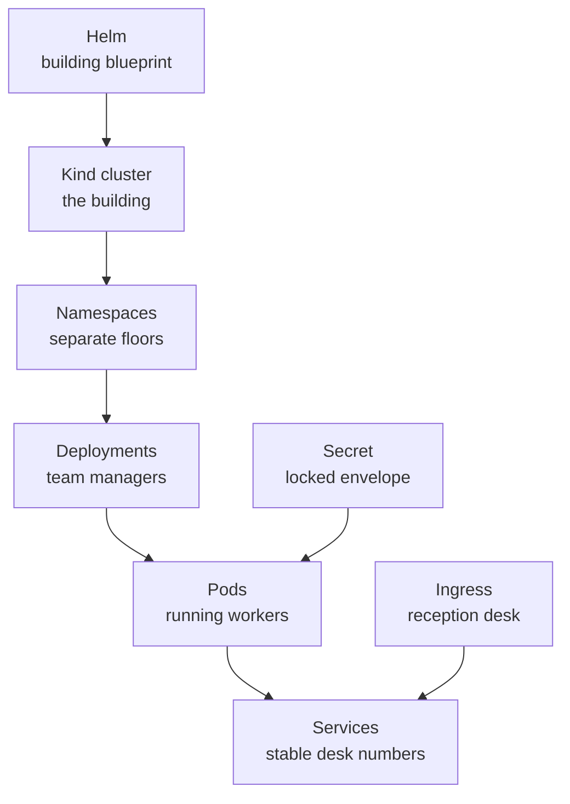
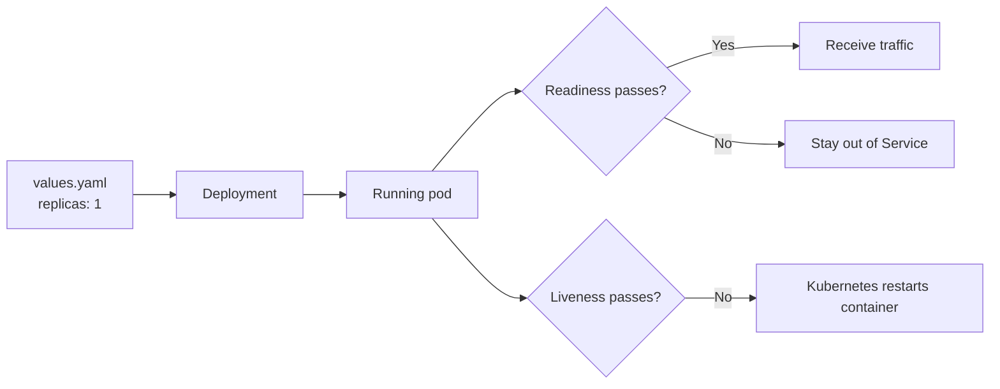

# Kubernetes concepts through this project

[← Documentation home](../README.md)

## The building analogy

| Object | What Kubernetes does | Project example |
|---|---|---|
| Cluster | Provides the full runtime | Kind cluster named `whiteboard` |
| Namespace | Groups and isolates names | `whiteboard-backend`, `whiteboard-frontend` |
| Deployment | Maintains desired pod count | One Deployment per service |
| Pod | Runs a container | One current replica per workload |
| Service | Gives pods a stable internal endpoint | `drawings-service:3002` |
| Ingress | Exposes HTTP paths | `/api/drawings` → drawings Service |
| Secret | Injects sensitive configuration | `MONGO_URI`, `JWT_SECRET` |
| Probe | Checks if a container is usable | Backend `/health` checks |

## Deployment controls

## Networking controls

ClusterIP Services are internal. Ingress is the HTTP entry point exposed through Kind’s port mappings.
