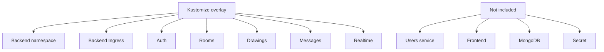
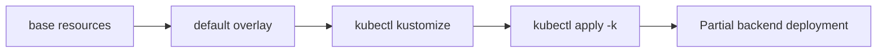

# Kustomize deployment

[← Documentation home](../README.md)

Kustomize is an alternative/reference path. It is not equal to the complete Helm chart.

## Exact scope



| Capability | Helm | Kustomize base |
|---|---:|---:|
| Five original backend services | Yes | Yes |
| Users service | Yes | No |
| Frontend | Yes | No |
| Two namespaces | Yes | Backend only |
| Ingress | Frontend + backend | Backend only |
| Configurable images/replicas | `values.yaml` | Patch or edit manifests |

## Apply lifecycle



```bash
kubectl kustomize backend/k8s/overlays/default
kubectl apply -k backend/k8s/overlays/default
```

```bash
kubectl delete -k backend/k8s/overlays/default
```

Use Helm for the repository’s documented complete application deployment.
