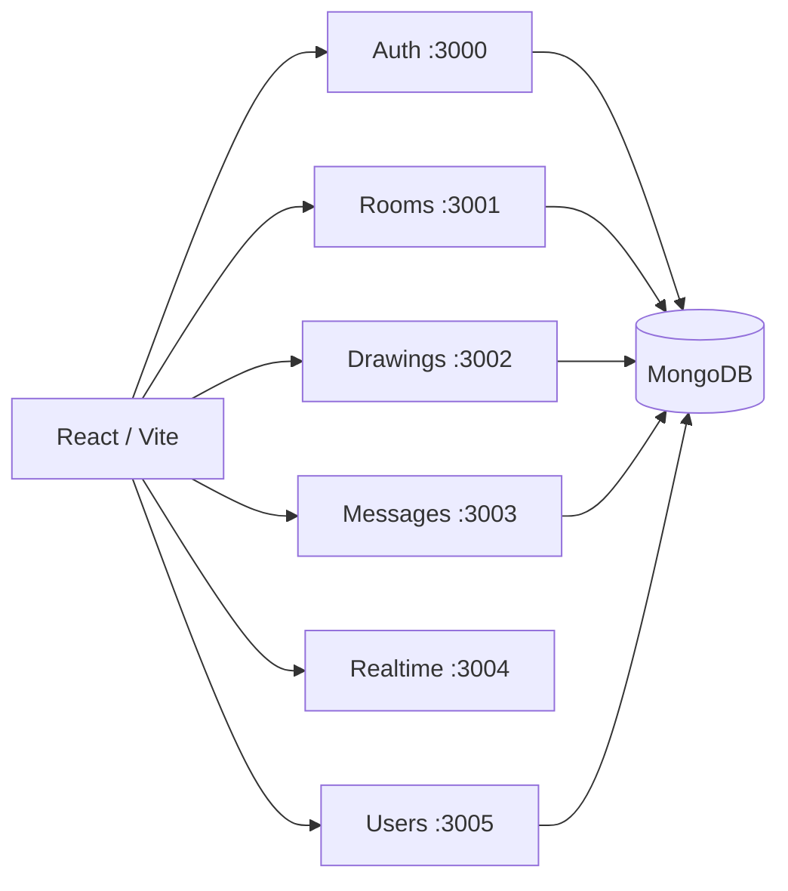
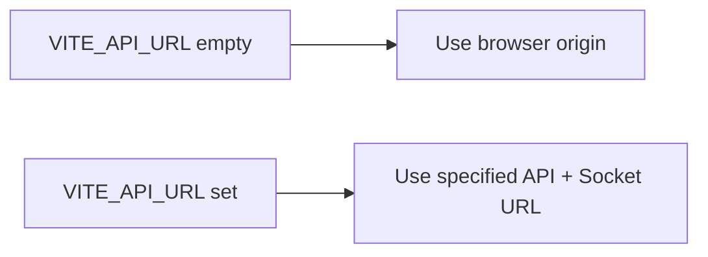

# Local development

[← Documentation home](../README.md)

Kubernetes is optional while developing service code.

## Local topology

Each backend service has its own `.env.example` and `npm start` command.

## Configuration

| Service | Required values |
|---|---|
| Auth | `PORT`, `MONGO_URI`, `JWT_SECRET` |
| Rooms | `PORT`, `MONGO_URI`, `JWT_SECRET` |
| Drawings | `PORT`, `MONGO_URI`, `JWT_SECRET` |
| Messages | `PORT`, `MONGO_URI`, `JWT_SECRET` |
| Realtime | `PORT`; optional `REDIS_URL` |
| Users | `PORT`, `MONGO_URI` |
| Frontend | optional build-time `VITE_API_URL` |

Because the frontend expects one base URL, local microservices need a reverse proxy/Ingress-style router or a shared gateway address. Running six ports alone is not enough for the current frontend routing model.
