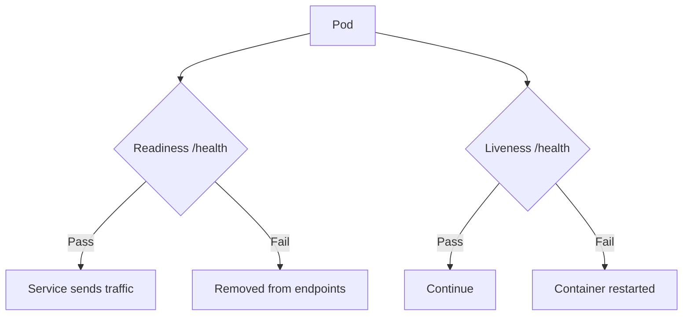
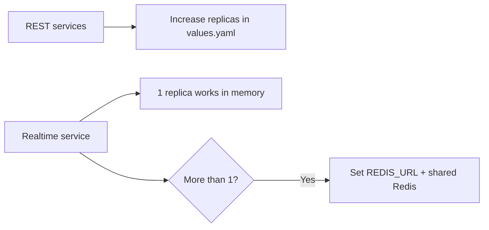
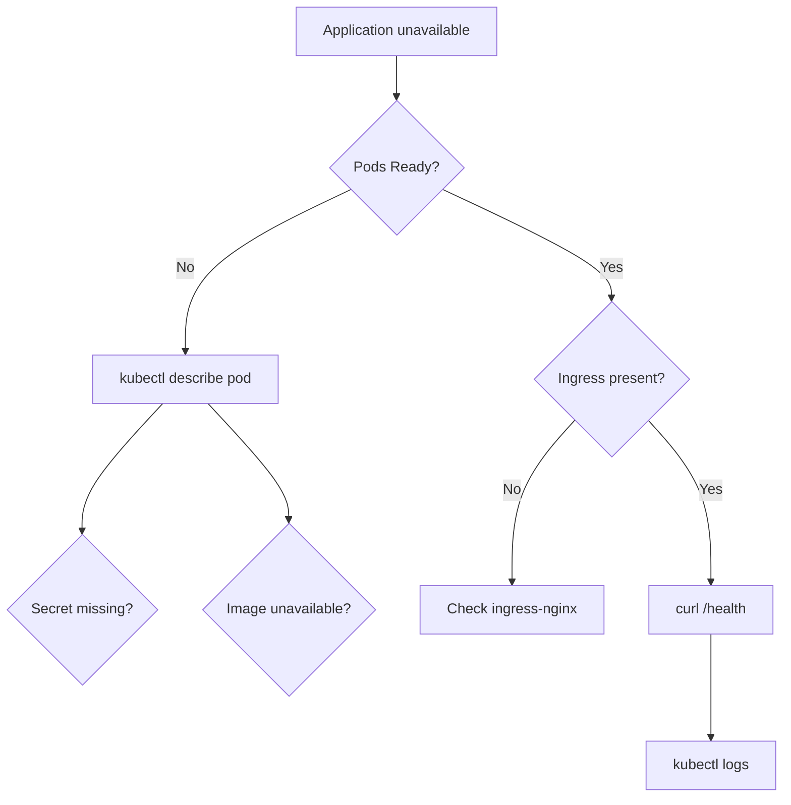
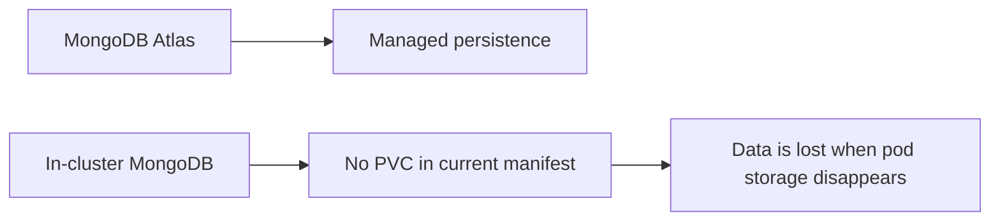

# Operations

[← Documentation home](../README.md)

## Health management



All six backend Helm Deployments define readiness and liveness probes. The frontend Deployment currently has neither.

## Scaling model



The realtime code supports the Socket.IO Redis adapter, but the chart does not deploy Redis or inject `REDIS_URL`.

## Troubleshooting path



Useful checks:

```bash
kubectl get all -n whiteboard-backend
kubectl get all -n whiteboard-frontend
kubectl get ingress -A
kubectl get events -A --sort-by=.lastTimestamp
```

## Persistence



Use Atlas or add a PersistentVolumeClaim before treating the in-cluster database as durable.
