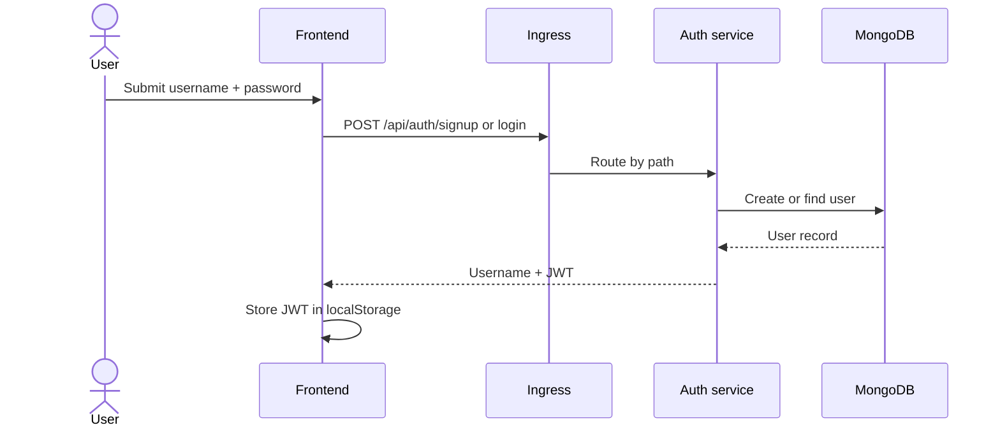
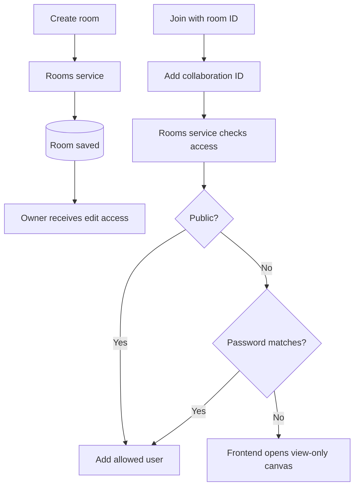
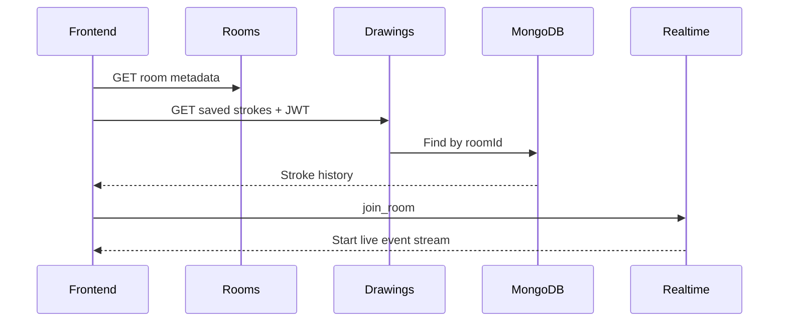
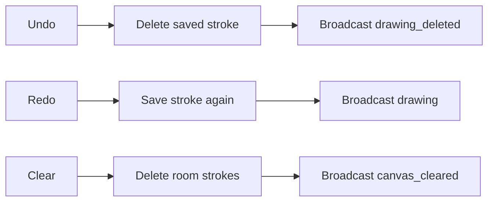

# Request flows

[← Documentation home](../README.md)

## Signup and login

```mermaid
sequenceDiagram
    actor User
    participant UI as Frontend
    participant Ingress
    participant Auth as Auth service
    participant DB as MongoDB

    User->>UI: Submit username + password
    UI->>Ingress: POST /api/auth/signup or login
    Ingress->>Auth: Route by path
    Auth->>DB: Create or find user
    DB-->>Auth: User record
    Auth-->>UI: Username + JWT
    UI->>UI: Store JWT in localStorage
```

## Create and join a room

```mermaid
flowchart TD
    Create[Create room] --> RoomService[Rooms service]
    RoomService --> Store[(Room saved)]
    Store --> Owner[Owner receives edit access]

    Join[Join with room ID] --> UserService[Add collaboration ID]
    UserService --> Check[Rooms service checks access]
    Check --> Type{Public?}
    Type -- Yes --> Edit[Add allowed user]
    Type -- No --> Password{Password matches?}
    Password -- Yes --> Edit
    Password -- No --> View[Frontend opens view-only canvas]
```

## Load a room

```mermaid
sequenceDiagram
    participant UI as Frontend
    participant Rooms
    participant Drawings
    participant DB as MongoDB
    participant Live as Realtime

    UI->>Rooms: GET room metadata
    UI->>Drawings: GET saved strokes + JWT
    Drawings->>DB: Find by roomId
    DB-->>UI: Stroke history
    UI->>Live: join_room
    Live-->>UI: Start live event stream
```

## Undo, redo and clear

```mermaid
flowchart LR
    Undo --> Delete[Delete saved stroke]
    Delete --> Event1[Broadcast drawing_deleted]
    Redo --> Save[Save stroke again]
    Save --> Event2[Broadcast drawing]
    Clear --> DeleteAll[Delete room strokes]
    DeleteAll --> Event3[Broadcast canvas_cleared]
```
