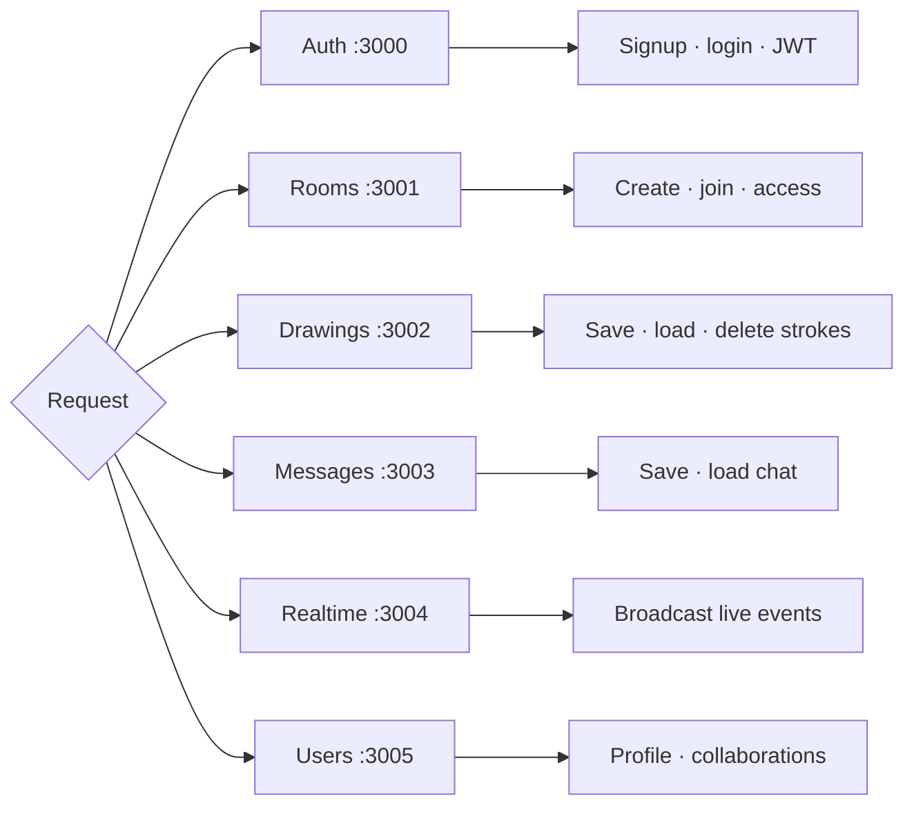

# Service catalog

[← Documentation home](../README.md)

## Ownership map

| Service | Ingress path | MongoDB | JWT check | Health |
|---|---|---:|---:|---|
| Auth | `/api/auth` | Yes | Issues JWT | `/health` |
| Rooms | `/api/rooms` | Yes | Private lookup only | `/health` |
| Drawings | `/api/drawings` | Yes | All routes | `/health` |
| Messages | `/api/messages` | Yes | All routes | `/health` |
| Realtime | `/socket.io` | No | No | `/health` |
| Users | `/api/users` | Yes | No | `/health` |

## REST surface

```mermaid
flowchart TD
    Auth --> Signup[POST /signup]
    Auth --> Login[POST /login]

    Rooms --> Create[POST /]
    Rooms --> Join[POST /join]
    Rooms --> Read[GET /:id]
    Rooms --> Owned[GET /getRoomsByOwner]
    Rooms --> Password[PUT /rooms/:roomId]

    Drawings --> Save[POST /]
    Drawings --> Load[GET /:roomId]
    Drawings --> Delete[DELETE /:id]
    Drawings --> Clear[DELETE /all/:roomId]

    Messages --> Send[POST /]
    Messages --> History[GET /:roomId]

    Users --> Add[POST /add-room-to-collabs]
    Users --> Collabs[GET /collabs/:username]
    Users --> Profile[GET /by-username/:username]
```

## Realtime events

| Client event | Broadcast result |
|---|---|
| `join_room` | Socket joins room; others receive `user_joined` |
| `drawing` | Others receive the new stroke |
| `drawing_deleted` | Others remove the stroke ID |
| `clear_canvas` | Everyone receives `canvas_cleared` |
| `send_message` | Everyone receives `receive_message` |
| disconnect | Room receives `user_left` |
